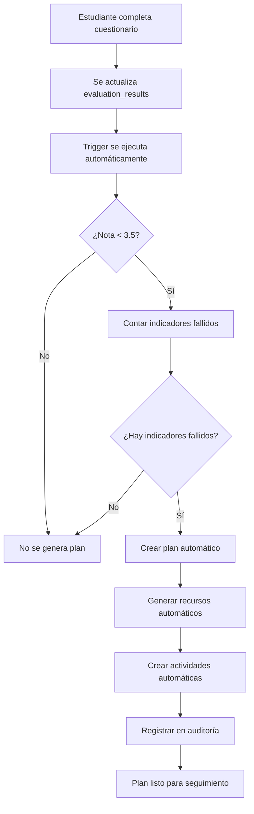

# 🤖 Sistema Automático de Planes de Mejoramiento - SEIO

## 📋 Descripción General

El Sistema Automático de Planes de Mejoramiento es una funcionalidad avanzada del proyecto SEIO que permite la generación automática de planes de recuperación académica cuando los estudiantes no alcanzan los indicadores requeridos en los cuestionarios.

## 🎯 Funcionalidades Principales

### 1. **Detección Automática**
- ✅ Monitorea automáticamente los resultados de evaluación (`evaluation_results`)
- ✅ Identifica estudiantes con notas menores a 3.5
- ✅ Cuenta indicadores no alcanzados por estudiante

### 2. **Generación Automática de Planes**
- ✅ Crea planes de mejoramiento personalizados
- ✅ Asigna recursos multimedia específicos por materia
- ✅ Genera actividades de refuerzo adaptadas
- ✅ Establece fechas límite automáticas (14 días)

### 3. **Recursos Automáticos**
- ✅ Videos educativos por materia
- ✅ Documentos de apoyo y guías de estudio
- ✅ Enlaces a recursos externos especializados
- ✅ Actividades de evaluación de refuerzo

### 4. **Seguimiento y Monitoreo**
- ✅ Dashboard de estadísticas en tiempo real
- ✅ Vista de planes automáticos generados
- ✅ Seguimiento de progreso por estudiante
- ✅ Alertas de planes próximos a vencer

## 🗄️ Estructura de Base de Datos

### Tablas Principales Involucradas

```sql
-- Tabla principal de planes de mejoramiento
improvement_plans
├── id (PK)
├── student_id (FK → students.id)
├── teacher_id (FK → teachers.id)
├── title
├── subject
├── description
├── activities
├── deadline
├── activity_status
├── teacher_notes
└── created_at

-- Recursos automáticos generados
recovery_resources
├── id (PK)
├── improvement_plan_id (FK → improvement_plans.id)
├── resource_type (video, document, link)
├── title
├── description
├── url
├── difficulty_level
└── order_index

-- Actividades automáticas generadas
recovery_activities
├── id (PK)
├── improvement_plan_id (FK → improvement_plans.id)
├── indicator_id (FK → indicators.id)
├── questionnaire_id (FK → questionnaires.id)
├── activity_type (quiz, exercise, assignment)
├── title
├── description
├── due_date
├── passing_score
└── status
```

### Triggers Automáticos

```sql
-- Trigger que se ejecuta al actualizar evaluation_results
CREATE TRIGGER tr_auto_improvement_plans_after_evaluation_update
AFTER UPDATE ON evaluation_results
FOR EACH ROW
BEGIN
    -- Lógica automática de generación de planes
    -- Solo se ejecuta si la nota cambió y es menor a 3.5
END;
```

## 🔧 Implementación Técnica

### Backend (Node.js/Express)

#### Archivo Principal: `server/utils/autoImprovementPlans.js`

```javascript
// Funciones principales exportadas:
export const processQuestionnaireResults = async (questionnaireId) => {
    // Procesa todos los estudiantes de un cuestionario
};

export const processStudentImprovementPlan = async (studentId, questionnaireId) => {
    // Procesa un estudiante específico
};
```

#### Rutas API: `server/routes/improvementPlans.js`

```javascript
// Nuevas rutas agregadas:
POST /api/improvement-plans/process-questionnaire/:questionnaireId
POST /api/improvement-plans/process-student/:studentId/:questionnaireId
GET  /api/improvement-plans/auto-stats
GET  /api/improvement-plans/auto-view
POST /api/improvement-plans/execute-procedure/:questionnaireId
```

### Frontend (React)

#### Componente Principal: `client/src/components/AutomaticImprovementPlansManager.js`

- ✅ Panel de control para procesamiento manual
- ✅ Estadísticas en tiempo real
- ✅ Vista de planes automáticos generados
- ✅ Interfaz intuitiva para profesores y administradores

## 🚀 Instalación y Configuración

### 1. **Ejecutar Migración de Base de Datos**

```bash
# Ejecutar el script de migración
mysql -u usuario -p seio_db < server/migrations/20250121_auto_improvement_plans_trigger.sql
```

### 2. **Verificar Instalación**

```bash
# Ejecutar script de prueba
cd server
node test-automatic-system.js
```

### 3. **Configurar Frontend**

```javascript
// Agregar ruta en App.js
import AutomaticImprovementPlansManager from './components/AutomaticImprovementPlansManager';

// Agregar ruta protegida
<Route path="/planes-automaticos" element={<AutomaticImprovementPlansManager />} />
```

## 📊 Uso del Sistema

### Para Profesores

1. **Acceso al Panel de Control**
   - Navegar a `/planes-automaticos`
   - Seleccionar cuestionario a procesar
   - Ejecutar procesamiento automático

2. **Monitoreo de Resultados**
   - Ver estadísticas en tiempo real
   - Revisar planes generados automáticamente
   - Ajustar recursos y actividades según necesidad

### Para Administradores

1. **Procesamiento Masivo**
   - Ejecutar procedimientos almacenados
   - Procesar múltiples cuestionarios
   - Generar reportes de estadísticas

2. **Monitoreo del Sistema**
   - Verificar funcionamiento de triggers
   - Revisar logs de auditoría
   - Optimizar rendimiento

## 🔄 Flujo Automático



## 📈 Estadísticas y Monitoreo

### Métricas Disponibles

- **Total de planes generados**
- **Planes por materia**
- **Planes por grado**
- **Tasa de completación**
- **Planes próximos a vencer**

### Vista de Monitoreo

```sql
-- Vista para monitorear planes automáticos
SELECT * FROM v_automatic_improvement_plans;
```

## 🛠️ Mantenimiento

### Limpieza de Datos Antiguos

```sql
-- Eliminar planes automáticos antiguos (más de 6 meses)
DELETE FROM improvement_plans 
WHERE teacher_notes LIKE '%generado automáticamente%' 
  AND created_at < DATE_SUB(NOW(), INTERVAL 6 MONTH);
```

### Optimización de Rendimiento

```sql
-- Índices recomendados
CREATE INDEX idx_improvement_plans_student_questionnaire 
ON improvement_plans(student_id, created_at);

CREATE INDEX idx_improvement_plans_teacher_status 
ON improvement_plans(teacher_id, activity_status);
```

## 🔍 Solución de Problemas

### Problemas Comunes

1. **Los planes no se generan automáticamente**
   - Verificar que el trigger esté instalado
   - Comprobar que las notas sean menores a 3.5
   - Revisar logs de auditoría

2. **Recursos no se crean**
   - Verificar permisos de base de datos
   - Comprobar URLs de recursos externos
   - Revisar estructura de tablas

3. **Frontend no muestra datos**
   - Verificar autenticación del usuario
   - Comprobar permisos de profesor/administrador
   - Revisar conexión API

### Logs de Depuración

```javascript
// Habilitar logs detallados
console.log('🔄 Procesando cuestionario automáticamente...');
console.log('✅ Plan de mejoramiento creado con ID:', planId);
console.log('📚 Recursos automáticos creados:', resourcesCount);
```

## 📚 Recursos Adicionales

### Documentación Relacionada

- [RUTAS_PLANES_MEJORAMIENTO.md](./RUTAS_PLANES_MEJORAMIENTO.md)
- [SISTEMA_RECUPERACION_IMPLEMENTACION.md](./SISTEMA_RECUPERACION_IMPLEMENTACION.md)
- [ESTRUCTURA_BASE_DATOS_SEIO.md](./ESTRUCTURA_BASE_DATOS_SEIO.md)

### Archivos de Configuración

- `server/migrations/20250121_auto_improvement_plans_trigger.sql`
- `server/utils/autoImprovementPlans.js`
- `server/routes/improvementPlans.js`
- `client/src/components/AutomaticImprovementPlansManager.js`

## 🎉 Conclusión

El Sistema Automático de Planes de Mejoramiento representa una mejora significativa en la gestión académica del proyecto SEIO, proporcionando:

- ✅ **Automatización completa** del proceso de recuperación
- ✅ **Personalización** según las necesidades específicas de cada estudiante
- ✅ **Eficiencia** en la gestión de recursos educativos
- ✅ **Seguimiento detallado** del progreso académico
- ✅ **Escalabilidad** para múltiples materias y grados

El sistema está diseñado para ser robusto, eficiente y fácil de mantener, proporcionando una solución integral para la recuperación académica automática.
